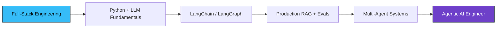

<!-- ═══════════════════════════ HEADER ═══════════════════════════ -->
<div align="center">
  
</div>

<!-- ═══════════════════════════ TYPING ═══════════════════════════ -->
<div align="center">
  <a href="https://prasad-portfolio-psi.vercel.app">
    
  </a>
</div>

<!-- ═══════════════════════════ SOCIALS ═══════════════════════════ -->
<div align="center">
  <a href="https://prasad-portfolio-psi.vercel.app"></a>
  <a href="https://linkedin.com/in/prasad-dinnapurkar"></a>
  <a href="mailto:prasaddinnapurkar@gmail.com"></a>
  <a href="https://github.com/Dinnapurkarprasad"></a>
  <br/>
  
  
  
</div>

<br/>

<!-- ═══════════════════════════ ABOUT ═══════════════════════════ -->


###  About Me

```yaml
name:      Prasad Dinnapurkar
role:      Software Developer @ Storyloom Solutions (Storyvord.io)
location:  Pune, India
focus:     Full-Stack Engineering → Agentic AI Systems
education: B.Tech CSE, MIT Chh. Sambhajinagar (2025)
```

- 🚀 Early engineer at an **AI media-tech startup** — I own features end-to-end, from **Postgres schema → DRF APIs → deployed React UI**
- ⚡ Took a rough product idea to production with minimal spec, more than once
- 🧠 Currently going deep on **AI agents** — LangChain, LangGraph, RAG, evals, tracing — agents that actually solve a problem, not demo chatbots
- 🎥 Built **GenAI media pipelines** (Celery + Redis + fal.ai) that turn scripts into shot-by-shot previsualization
- 🏆 **Runner-Up**, New GenAI Hackathon 2024 — *KrushiMitra*
- 💬 Ask me about **Next.js performance, Django REST, Celery queues, multi-agent pipelines**

<br clear="right"/>

---

<!-- ═══════════════════════════ TECH STACK ═══════════════════════════ -->
<h2 align="center">🛠️ Tech Stack</h2>

<div align="center">

**Languages**


<br/><br/>

**Frontend**


<br/>


<br/><br/>

**Backend**


<br/>


<br/><br/>

**Databases & Cache**


<br/><br/>

**AI / GenAI**


<br/>


<br/><br/>

**AI-Assisted Development**


<br/><br/>

**Cloud, DevOps & Tools**


<br/>


</div>

---

<!-- ═══════════════════════════ EXPERIENCE ═══════════════════════════ -->
<h2 align="center">💼 What I'm Building at Work</h2>

<div align="center">
  
  
  
</div>

<br/>

<details open>
<summary><b>🎬 AI Media-Tech Platform · click to expand</b></summary>

<br/>

| | What I shipped |
|:--|:--|
| 🧩 | **Reusable React + Next.js + TypeScript component system** — dashboards, data tables, multi-step forms, modals and file-upload flows powering the platform's core modules, with Context API and React Query for shared state |
| 🔌 | **RESTful APIs on Django REST Framework + PostgreSQL + Celery** — owning serializers, permissions and business logic end-to-end across multiple product modules |
| ⚡ | **Page load 4.2s → 2.1s, Lighthouse 61 → 89** — migrated client-heavy routes to Next.js Server Components and streaming SSR, plus code splitting, dynamic imports, image optimization and memoization |
| 🎥 | **Real-time communication layer (WebRTC / LiveKit)** — live video conferencing, audio channels and virtual backgrounds, validated at 50+ concurrent participants |
| 🤖 | **Async GenAI media pipelines with Celery + Redis** — integrated and benchmarked 3 generative video/image models via fal.ai to turn scripts into shot-by-shot previsualization |

</details>

---

<!-- ═══════════════════════════ PROJECTS ═══════════════════════════ -->
<h2 align="center">🚀 Featured Projects</h2>

<table>
<tr>
<td width="50%" valign="top">

### 🧠 Verity — Multi-Agent AI Research System
<a href="https://github.com/Dinnapurkarprasad"></a>

`Next.js` `TypeScript` `FastAPI` `LangChain` `Groq` `Tavily` `Postgres (Neon)`

- Multi-agent pipeline that turns **one topic query into an 8-section cited report**
- LangChain agents (Tavily search + BeautifulSoup reader) orchestrated via an **LCEL chain with a critic step** that strips unsupported claims
- **18 LLM calls**, section-by-section, to stay under an 8k token-per-request ceiling
- Long-running job UI: client-side polling, incremental section rendering, skeletons and progress states
- Secured with **JWT httpOnly cookies + Google OAuth 2.0**

</td>
<td width="50%" valign="top">

### 🧱 Microservices Social Media Backend
<a href="https://github.com/Dinnapurkarprasad"></a>

`Node.js` `Express` `Docker` `RabbitMQ` `Redis` `MongoDB`

- **Four independent services** — Auth, Posts, Media, Search — with clear service boundaries and route-level middleware
- Every service containerized with **Docker Compose**, decoupled via **RabbitMQ** for async inter-service communication and independent scaling
- **Redis-backed caching and sessions**, JWT auth and rate limiting enforced as Express middleware across boundaries

</td>
</tr>
<tr>
<td width="50%" valign="top">

### 🌾 KrushiMitra — GenAI for Farmers


`GenAI` `LLM APIs` `Full-Stack`

- Agriculture-focused GenAI assistant built under hackathon time pressure
- Placed **Runner-Up** out of the full cohort

</td>
<td width="50%" valign="top">

### 🔎 Agentic RAG System *(in progress)*


`FastAPI` `pgvector` `Cohere Rerank` `Ragas` `Langfuse` `Next.js + SSE`

- Production-shaped RAG: hybrid retrieval → **rerank → grounded answer with citations**
- **Ragas evals + Langfuse tracing** wired in from day one, not bolted on later
- Streaming answers over **SSE**, deployed with docker-compose on EC2

</td>
</tr>
</table>

---

<!-- ═══════════════════════════ CURRENTLY LEARNING ═══════════════════════════ -->
<h2 align="center">🌱 Currently Learning</h2>

<div align="center">




</div>

---

<!-- ═══════════════════════════ STATS ═══════════════════════════ -->
<h2 align="center">📊 GitHub Stats</h2>

<div align="center">
  
  
</div>

<div align="center">
  
</div>

<div align="center">
  
</div>

<div align="center">
  
</div>

<!-- ═══════════════════════════ SNAKE ═══════════════════════════ -->
<div align="center">
  
</div>

---

<!-- ═══════════════════════════ FOOTER ═══════════════════════════ -->
<div align="center">

### 💬 Let's build something

<a href="mailto:prasaddinnapurkar@gmail.com"></a>
<a href="https://linkedin.com/in/prasad-dinnapurkar"></a>
<a href="https://prasad-portfolio-psi.vercel.app"></a>

<br/><br/>

*"Ship it, measure it, then make it smarter."*


</div>
